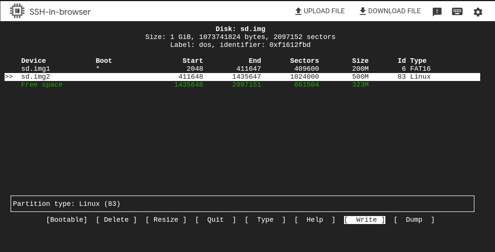
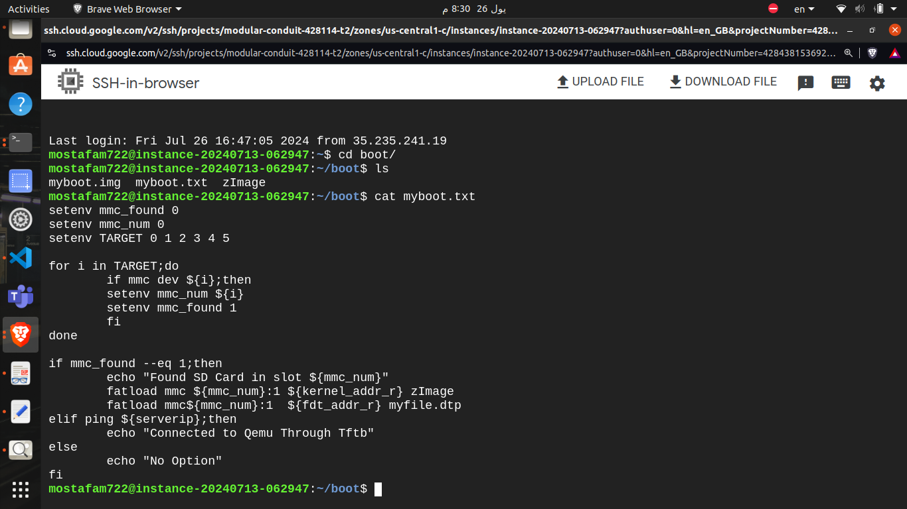

# Load Image from SD Virtual Card
- We will Create virtual SD card 
``` bash
touch sd.img
```
- Write zeros to this file of size = 1M
``` bash 
dd if=/dev/zero of=sd.img bs=1M count=1024
``` 

- Drivide it into partitions --> FAT16 (Primary - Loadable) = 200 MB , ext4 = 500 MB
``` bash
cfdisk sd.img
```
- This will open a GUI so we will chose dos type



- Then we will attach it with loop to be mapped as block device by running next code 
```bash
sudo losetup -f --show --partscan sd.img
```
- You can show ur sd Card loop by running 
```bash 
losetup -a | grep loop5
```
- Then we Format the boot and rootfs partition to be Fat16 and ext4 
``` bash
sudo mkfs.vfat -F 16 -n boot /dev/loop5p1
sudo mkfs.ext4 -l rootfs /dev/loop5p2
```
- Last step in SD card is to mount it 
``` bash 
cd ~
mkdir boot 
mkdir rootfs
$ sudo mount ${DISK}p1 ~/boot
$ sudo mount ${DISK}p2 ~/rootfs
```
# Write the Script

- put Files into Boot folders and create zImage of the script

# Booting from SD-Card

- Go to u-boot directory and Run Qemu attaching path of sd card
```bash 
qemu-system-arm -M vexpress-a9 -nographic -kernel ./u-boot  -sd /home/mostafam722/sd.img 
```
- Then You need to check having sd card by running
``` bash 
mmc dev 
```

- Load file from mmc boot file 
``` bash 
fatload mmc 0:1 ${KERNEL_addr_r} zImage
source ${KERNEL_addr_r}
```

