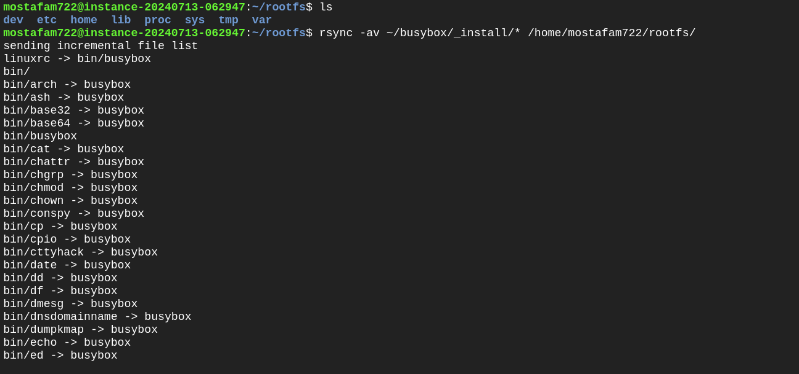

# Task2 --> Booting from initrmfs

```bash 
cd ~/rootfs
```
- First Setup Rootfile system hirarchy
``` bash 
mkdir   dev  etc  home  lib  proc  sys  tmp  var
mkdir ./etc/init.d
```
- Create inside init.d Rcs file which is run a shell script, rcS , when init is started , which will be called by the init program, this is init program reads the the configuration file, /etc/inittab. Inside this file first command ::sysinit:/etc/init.d/rcS.
``` bash
touch rcS
sudo vim rcS
#!/bin/sh

mount -t proc nodev /proc
mount -t sysfs nodev /sys
mount -t devtmpfs nodev /dev

chmod +x rcS
```
- Copy content of _install to rootfile system
``` bash 
rsync -av ~/busybox/_install/* ~/rootfs
```


- Now let's create the inittab file which will be read by the init program

``` bash
sudo vim ./etc/inittab
```
### Here is File system after stageing 
![Hierarchy] (./fstree.png)

- Now let's exam the permission 
``` bash 
ls -lh ~/rootfs
```
- Change owner of file
``` bash 
sudo chown -R root:root ~/rootfs
```
- Let's repeat assiging loops to sd card

### OK! If you followed my steps you will find a surprise!!!
- After mounting rootfs everything will be lost so 
### Repeat all steps again

- Now Let's move zImage and dtb to boot 

# Let's run Qemu

``` bash 
fatload mmc 0:1 ${kernel_addr_r} zImage
fatload mmc 0:1 ${fdt_addr_r} vexpress-v2p-ca9.dtb 
edit: console=tty0 console=ttyAMA0,38400n8 root=/dev/mmcblk0p2 rootfstype=ext4 rw  rootwait init=/sbin/init 
bootz ${kernel_addr_r} - ${fdt_addr_r} 
```
![boot_kernel_sd] (./bootkernelsd.png)

